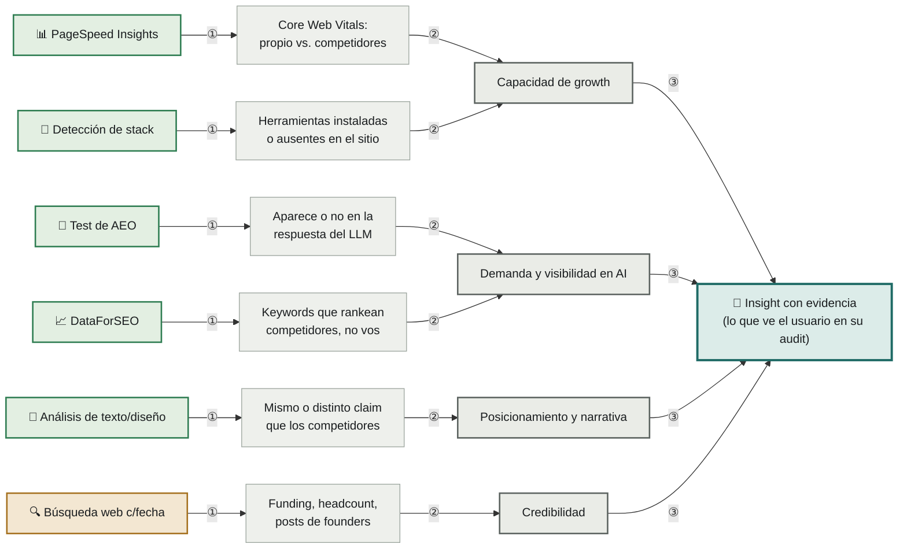

# Referencia: qué devuelve cada herramienta y a qué insight llega

Esto conecta las herramientas del [stack](stack.md) con el resultado final: qué tipo de dato crudo trae cada una, a qué familia de insight ([`tipos-de-insight.md`](tipos-de-insight.md)) alimenta, y cómo eso termina siendo el insight que el usuario ve en su audit.

| # | Qué pasa |
|---|---|
| **①** | La herramienta consulta al sitio (propio y de competidores) o a una fuente externa, y trae un dato crudo |
| **②** | Ese dato crudo se interpreta como señal de una familia de insight específica |
| **③** | La familia de insight se arma como el objeto final ([`insight-object.md`](insight-object.md)) — claim, evidencia, mecanismo, dirección, confianza — que es lo que el usuario ve en su audit |

Verde = evidencia **medida** (se afirma directo). Ámbar = evidencia **recuperada** (se afirma con fuente y fecha). Ver [`niveles-de-evidencia.md`](niveles-de-evidencia.md) para el detalle de esta clasificación.

## Por qué varias herramientas convergen en la misma familia

PageSpeed y la detección de stack alimentan las dos a "Capacidad de growth" — un sitio lento y un stack sin herramientas de conversión son la misma familia de problema (el sitio no está preparado técnicamente para escalar), aunque el dato crudo sea distinto. Lo mismo pasa con el test de AEO y DataForSEO sobre "Demanda y visibilidad en AI": una mide si la marca aparece en respuestas de IA, la otra si rankea en Google — ambas son formas de "no te encuentran cuando buscan la categoría". La función de selección (ver [`explanation/arquitectura.md`](../explanation/arquitectura.md)) decide cuál de los dos datos es más fuerte para ese insight en particular, no ambos a la vez.

## Lo que no está en este mapa: los cruces secundarios

Esta vista muestra el mapeo principal, pero algunas herramientas también pueden alimentar una segunda familia si el contexto lo pide:

- **Detección de stack** → también puede señalar "Funnel y conversión" cuando lo que falta es, puntualmente, una herramienta de conversión (chat en vivo, calendario de demos).
- **Análisis de texto/diseño** → también puede señalar "Cobertura de comité de compra" cuando el copy le habla a un solo rol y la decisión la toman varios.
- **Búsqueda web con fuente y fecha** → también puede señalar "Posicionamiento y narrativa" cuando lo que dice el founder afuera del sitio no está reflejado adentro (el ejemplo del [tutorial](../tutorials/primer-audit-manual.md)).

Estos cruces los decide el agente al generar candidatos, según qué evidencia encontró en cada caso concreto — no son un mapeo fijo 1 a 1.
