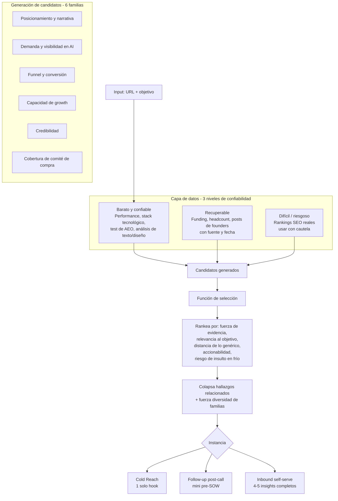

# Arquitectura

## Diagrama de flujo

## Los 3 niveles de evidencia

Cada insight cita de dónde sale cada dato, y eso define cómo se afirma:

| Origen | Cómo se afirma | Ejemplos |
|---|---|---|
| **Medido** | Directo, como hecho | Lighthouse, stack detectado, ranking real, presencia en respuesta de un LLM corriendo la query en vivo |
| **Recuperado** | Con fuente y fecha chequeada | Ronda de inversión, post de un founder, headcount |
| **Inferido** | Como hipótesis, nunca como hecho | "Las señales sugieren que..." |

## El objetivo determina el framing, no el contenido

El mismo hallazgo cambia de titular según el objetivo de la empresa analizada. Un sitio sin proof, para quien levanta funding es "no parecés fundable"; para quien quiere clientes es "no generás confianza para convertir". El objetivo no crea insights nuevos — decide cuáles suben al top y con qué encabezado.

- **En inbound:** el objetivo lo captura el onboarding del formulario.
- **En cold reach:** lo infiere el agente a partir del contexto (ej: una empresa que levantó ronda y contrata un growth lead tiene, probablemente, el objetivo de escalar pipeline).
