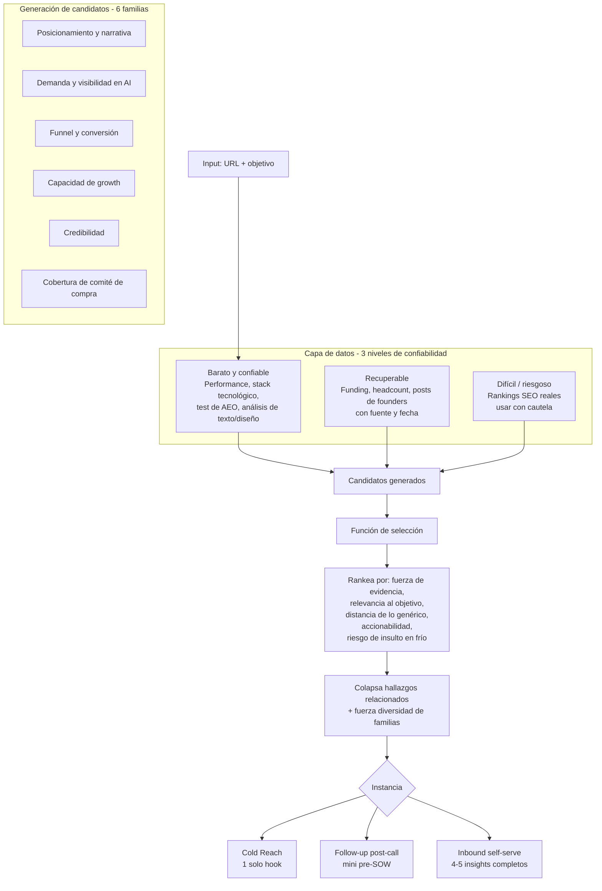

# Por qué la arquitectura está armada así

## El flujo completo

## Por qué 3 niveles de datos y no uno solo

El brief original de Cristopher marca un problema concreto de este tipo de herramientas: un LLM no sabe rankings SEO reales, no sabe si una empresa levantó una ronda la semana pasada, y si se le pregunta igual, inventa una respuesta con la misma confianza que si supiera el dato de verdad. Separar los datos en "barato y confiable", "recuperable pero sensible a la fecha" y "difícil o riesgoso" (ver [`reference/niveles-de-evidencia.md`](../reference/niveles-de-evidencia.md)) obliga al sistema a ser honesto sobre qué tan seguro está de cada afirmación, en vez de sonar igual de seguro sobre todo.

## Por qué existe una función de selección, y no se muestran todos los candidatos

El motor genera muchos candidatos de insight por auditoría. La mayoría son ruido: repiten el mismo hallazgo con otras palabras, son demasiado genéricos, o — en cold reach — son ciertos pero suficientemente humillantes como para cerrar la conversación antes de que empiece. La función de selección existe para hacer ese descarte antes de que el destinatario lo vea, priorizando por:

- fuerza de la evidencia que lo respalda,
- relevancia al objetivo inferido o declarado,
- qué tan lejos está de un consejo genérico aplicable a cualquier sitio,
- si es accionable a través del sitio web,
- y, solo en cold reach, el riesgo de insultar.

Después de rankear, se colapsan los hallazgos relacionados en una sola tesis (para no repetir el mismo punto dos veces con distinta evidencia) y se fuerza diversidad de familias — así el resultado final no son 5 variaciones del mismo problema, sino un panorama de ángulos distintos.

## Por qué el mismo motor sirve para 3 instancias distintas

Cold reach, follow-up post-call e inbound comparten exactamente el mismo pipeline hasta el paso de selección — lo único que cambia es qué objetivo alimenta la generación de candidatos y cuánto del stack seleccionado se muestra. Esto es deliberado: separar "cómo se generan los insights" de "cómo se presentan" evita mantener tres lógicas de negocio distintas y permite que una mejora en la calidad del motor (por ejemplo, mejor detección de evidencia) beneficie a las 3 instancias a la vez. Ver [`reference/instancias.md`](../reference/instancias.md) para el detalle de cada una.
