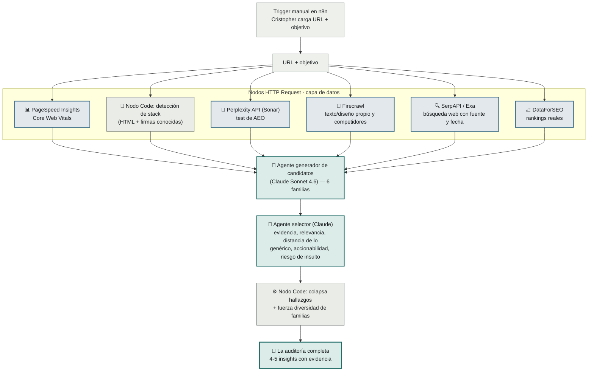

# Por qué la arquitectura está armada así

## El flujo completo

El pipeline se orquesta y vive dentro de **n8n** (la herramienta de automatización con la que Cristopher va a operar el proyecto). En este MVP arranca con un trigger manual — Cristopher carga la URL y el objetivo a mano — y termina en la auditoría completa. No hay web, no hay formulario, no hay envío de mail: eso quedó fuera de alcance (ver [`roadmap.md`](../roadmap.md)).

| Color | Qué significa |
|---|---|
| 🟩 Verde azulado | **Agente de IA** (Claude) razonando — genera candidatos o rankea por criterio subjetivo. Detalle de cada uno en [`reference/agentes.md`](../reference/agentes.md) |
| 🟦 Azul | **Llamada a una herramienta externa** — HTTP Request a una API (PageSpeed, Perplexity, Firecrawl, SerpAPI/Exa, DataForSEO) |
| ⬜ Gris | **Nodo de código determinístico** — sin IA: parsear HTML, colapsar hallazgos, forzar diversidad |

## Qué hace el sistema con el resultado

El pipeline termina cuando entrega la auditoría — no manda mails, no le habla a un prospecto, no elige un canal. El resultado queda guardado en algún lugar que Cristopher pueda abrir (un Google Doc o una fila en Sheets, a definir en la implementación) para que él lo use en lo que necesite después. Eso ya es su proceso comercial, no parte de este sistema — ver la [nota de archivo](../../archive/v1-con-instancias/NOTA-DE-ARCHIVO.md) para el porqué de este límite.

## Por qué 3 niveles de datos y no uno solo

El brief original de Cristopher marca un problema concreto de este tipo de herramientas: un LLM no sabe rankings SEO reales, no sabe si una empresa levantó una ronda la semana pasada, y si se le pregunta igual, inventa una respuesta con la misma confianza que si supiera el dato de verdad. Separar los datos en "barato y confiable", "recuperable pero sensible a la fecha" y "difícil o riesgoso" (ver [`reference/niveles-de-evidencia.md`](../reference/niveles-de-evidencia.md)) obliga al sistema a ser honesto sobre qué tan seguro está de cada afirmación, en vez de sonar igual de seguro sobre todo. Ver [`reference/capa-de-datos.md`](../reference/capa-de-datos.md) para el mapa completo: qué devuelve cada herramienta del stack y a qué familia de insight llega.

## Por qué existe un agente selector, además del generador

El motor genera muchos candidatos de insight por auditoría. La mayoría son ruido: repiten el mismo hallazgo con otras palabras, son demasiado genéricos, o son ciertos pero suficientemente humillantes como para arruinar la puerta de entrada. Por eso la selección son dos nodos distintos, no uno:

- **El agente selector (nodo `SEL`)** — un llamado más a Claude, que rankea cada candidato por criterios que requieren juicio: fuerza de la evidencia que lo respalda, relevancia al objetivo indicado, qué tan lejos está de un consejo genérico aplicable a cualquier sitio, si es accionable a través del sitio web, y el riesgo de insultar. Es un agente y no código porque estos criterios son subjetivos, no una fórmula.
- **El nodo de código (`COL`)** — determinístico, sin IA: colapsa los hallazgos relacionados en una sola tesis (para no repetir el mismo punto dos veces con distinta evidencia) y fuerza que los insights finales toquen familias distintas entre sí. Esto sí es una regla mecánica, así que no hace falta gastar una llamada a un LLM en resolverla.

El resultado final no son 5 variaciones del mismo problema, sino un panorama de ángulos distintos.

## Por qué n8n como capa de orquestación, y no un backend a medida

Como Cristopher va a operar todo el proyecto sobre n8n, sus nodos HTTP Request llaman a cada fuente de datos de la capa de evidencia, y sus nodos de IA generan y seleccionan los insights — no hace falta programar ni hostear un backend aparte. Para este MVP el trigger es manual porque no hay ningún canal (web, mail) esperando el resultado en el momento; si más adelante se retoma la idea de un self-serve web (ver [`roadmap.md`](../roadmap.md)), ese trigger manual se reemplaza por un webhook sin tocar el resto del pipeline.
