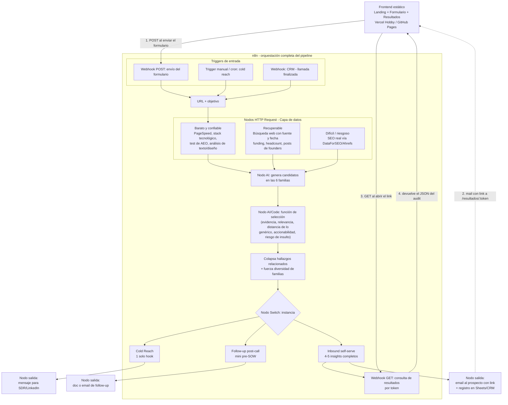

# Por qué la arquitectura está armada así

## El flujo completo

Todo el pipeline se orquesta y vive dentro de **n8n** (la herramienta de automatización con la que Cristopher va a operar el proyecto) — no hay un backend separado. n8n recibe el trigger, llama a cada fuente de datos con nodos HTTP Request, llama al modelo para generar y seleccionar los insights, y entrega el resultado por el canal que corresponda a cada instancia.

## Dónde vive la interfaz (el frontend)

Todo lo anterior es lógica — no tiene pantallas. La landing, el formulario y la pantalla de resultados (ver el [mockup navegable](../../README.md#%EF%B8%8F-ui-del-producto-mockup)) son un **frontend estático liviano**, hosteado aparte de n8n (Vercel Hobby o GitHub Pages, ambos gratis — ver [`reference/stack.md`](../reference/stack.md)) porque construir una interfaz con varias pantallas y estado visual como texto HTML dentro de un nodo de n8n es incómodo de mantener y versionar.

El frontend nunca tiene lógica propia — es una cara visible sobre n8n:

1. El formulario hace un **POST** al webhook de n8n cuando el prospecto lo envía, y muestra la pantalla de "procesando" de forma optimista (no espera en vivo a que termine el pipeline completo).
2. Cuando el audit termina, n8n manda el mail con un link a `/resultados/:token`.
3. Esa pantalla de resultados hace un **GET** a un segundo webhook de n8n con ese token.
4. n8n devuelve el JSON del audit (los insights ya generados y seleccionados) y el frontend lo renderiza como las tarjetas del mockup.

Esto mantiene toda la lógica y el estado en un solo lugar (n8n), y el frontend queda desechable — se puede rediseñar la UI sin tocar el pipeline, porque solo consume dos endpoints.

## Por qué n8n como capa de orquestación, y no un backend a medida

El plan original contemplaba un backend propio (hosteado en algo como Vercel o Railway) para conectar el formulario con el motor. Como Cristopher va a operar todo el proyecto sobre n8n, ese rol lo cumple n8n directamente: sus triggers (webhook, cron, o disparado desde el CRM) reemplazan al backend custom, sus nodos HTTP Request llaman a cada fuente de datos de la capa de evidencia, y sus nodos de IA generan y seleccionan los insights. Esto simplifica el proyecto — una sola herramienta para operar, monitorear y debuggear la lógica completa. Lo único que queda fuera de n8n es el frontend estático descrito arriba, porque es una interfaz visual, no lógica de negocio.

## Por qué 3 niveles de datos y no uno solo

El brief original de Cristopher marca un problema concreto de este tipo de herramientas: un LLM no sabe rankings SEO reales, no sabe si una empresa levantó una ronda la semana pasada, y si se le pregunta igual, inventa una respuesta con la misma confianza que si supiera el dato de verdad. Separar los datos en "barato y confiable", "recuperable pero sensible a la fecha" y "difícil o riesgoso" (ver [`reference/niveles-de-evidencia.md`](../reference/niveles-de-evidencia.md)) obliga al sistema a ser honesto sobre qué tan seguro está de cada afirmación, en vez de sonar igual de seguro sobre todo.

## Por qué existe una función de selección, y no se muestran todos los candidatos

El motor genera muchos candidatos de insight por auditoría. La mayoría son ruido: repiten el mismo hallazgo con otras palabras, son demasiado genéricos, o — en cold reach — son ciertos pero suficientemente humillantes como para cerrar la conversación antes de que empiece. La función de selección existe para hacer ese descarte antes de que el destinatario lo vea, priorizando por:

- fuerza de la evidencia que lo respalda,
- relevancia al objetivo inferido o declarado,
- qué tan lejos está de un consejo genérico aplicable a cualquier sitio,
- si es accionable a través del sitio web,
- y, solo en cold reach, el riesgo de insultar.

Después de rankear, se colapsan los hallazgos relacionados en una sola tesis (para no repetir el mismo punto dos veces con distinta evidencia) y se fuerza diversidad de familias — así el resultado final no son 5 variaciones del mismo problema, sino un panorama de ángulos distintos.

## Por qué el mismo motor sirve para 3 instancias distintas

Cold reach, follow-up post-call e inbound comparten exactamente el mismo pipeline hasta el paso de selección — lo único que cambia es qué objetivo alimenta la generación de candidatos y cuánto del stack seleccionado se muestra. Esto es deliberado: separar "cómo se generan los insights" de "cómo se presentan" evita mantener tres lógicas de negocio distintas y permite que una mejora en la calidad del motor (por ejemplo, mejor detección de evidencia) beneficie a las 3 instancias a la vez. Ver [`reference/instancias.md`](../reference/instancias.md) para el detalle de cada una.
