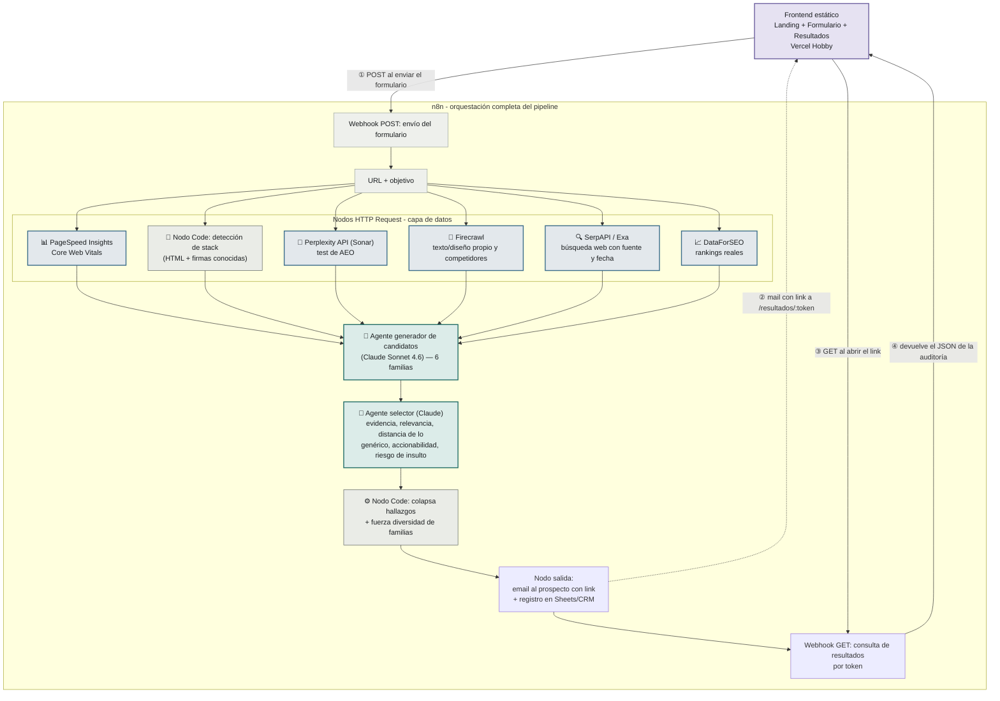

# Por qué la arquitectura está armada así

## El flujo completo

Todo el pipeline se orquesta y vive dentro de **n8n** (la herramienta de automatización con la que Cristopher va a operar el proyecto) — no hay un backend separado. El MVP incluye la entrega web self-serve: alguien completa el formulario, y el sistema le arma y le manda su auditoría solo, sin que Cristopher tenga que estar mirando. Este diagrama muestra cada nodo real: qué herramienta consulta cada llamada, y cuáles pasos son un **agente de IA** razonando (color distinto) contra un nodo de código determinístico o una llamada HTTP simple.

| Color | Qué significa |
|---|---|
| 🟩 Verde azulado | **Agente de IA** (Claude) razonando — genera candidatos o rankea por criterio subjetivo. Detalle de cada uno en [`reference/agentes.md`](../reference/agentes.md) |
| 🟦 Azul | **Llamada a una herramienta externa** — HTTP Request a una API (PageSpeed, Perplexity, Firecrawl, SerpAPI/Exa, DataForSEO) |
| ⬜ Gris | **Nodo de código determinístico** — sin IA: parsear HTML, colapsar hallazgos, forzar diversidad |
| 🟪 Violeta | El frontend estático, fuera de n8n |

**①②③④** es el ciclo de ida y vuelta con el frontend: envío del formulario, mail con el link, consulta de resultados, y la respuesta con el JSON de la auditoría.

## Dónde vive la interfaz (el frontend)

Todo lo anterior es lógica — no tiene pantallas. La landing, el formulario y la pantalla de resultados (ver el mockup navegable en la sección "🖼️ UI del producto" del [README](../../README.md)) son un **frontend estático liviano**, hosteado aparte de n8n en **Vercel Hobby** (gratis — ver [`reference/stack.md`](../reference/stack.md)) porque construir una interfaz con varias pantallas y estado visual como texto HTML dentro de un nodo de n8n es incómodo de mantener y versionar.

El frontend nunca tiene lógica propia — es una cara visible sobre n8n:

1. El formulario hace un **POST** al webhook de n8n cuando el visitante lo envía (URL de su sitio + su objetivo), y muestra la pantalla de "procesando" de forma optimista (no espera en vivo a que termine el pipeline completo).
2. Cuando la auditoría termina, n8n manda el mail con un link a `/resultados/:token`.
3. Esa pantalla de resultados hace un **GET** a un segundo webhook de n8n con ese token.
4. n8n devuelve el JSON de la auditoría (los insights ya generados y seleccionados) y el frontend lo renderiza como las tarjetas del mockup.

Esto mantiene toda la lógica y el estado en un solo lugar (n8n), y el frontend queda desechable — se puede rediseñar la UI sin tocar el pipeline, porque solo consume dos endpoints.

## Por qué n8n como capa de orquestación, y no un backend a medida

Como Cristopher va a operar todo el proyecto sobre n8n, sus triggers (webhook) reemplazan a un backend custom, sus nodos HTTP Request llaman a cada fuente de datos de la capa de evidencia, y sus nodos de IA generan y seleccionan los insights — no hace falta programar ni hostear un backend aparte. Lo único que queda fuera de n8n es el frontend estático descrito arriba, porque es una interfaz visual, no lógica de negocio.

## Por qué 3 niveles de datos y no uno solo

El brief original de Cristopher marca un problema concreto de este tipo de herramientas: un LLM no sabe rankings SEO reales, no sabe si una empresa levantó una ronda la semana pasada, y si se le pregunta igual, inventa una respuesta con la misma confianza que si supiera el dato de verdad. Separar los datos en "barato y confiable", "recuperable pero sensible a la fecha" y "difícil o riesgoso" (ver [`reference/niveles-de-evidencia.md`](../reference/niveles-de-evidencia.md)) obliga al sistema a ser honesto sobre qué tan seguro está de cada afirmación, en vez de sonar igual de seguro sobre todo. Ver [`reference/capa-de-datos.md`](../reference/capa-de-datos.md) para el mapa completo: qué devuelve cada herramienta del stack y a qué familia de insight llega.

## Por qué existe un agente selector, además del generador

El motor genera muchos candidatos de insight por auditoría. La mayoría son ruido: repiten el mismo hallazgo con otras palabras, son demasiado genéricos, o son ciertos pero suficientemente humillantes como para arruinar la puerta de entrada. Por eso la selección son dos nodos distintos, no uno:

- **El agente selector (nodo `SEL`)** — un llamado más a Claude, que rankea cada candidato por criterios que requieren juicio: fuerza de la evidencia que lo respalda, relevancia al objetivo indicado, qué tan lejos está de un consejo genérico aplicable a cualquier sitio, si es accionable a través del sitio web, y el riesgo de insultar. Es un agente y no código porque estos criterios son subjetivos, no una fórmula.
- **El nodo de código (`COL`)** — determinístico, sin IA: colapsa los hallazgos relacionados en una sola tesis (para no repetir el mismo punto dos veces con distinta evidencia) y fuerza que los insights finales toquen familias distintas entre sí. Esto sí es una regla mecánica, así que no hace falta gastar una llamada a un LLM en resolverla.

El resultado final no son 5 variaciones del mismo problema, sino un panorama de ángulos distintos.

## Qué hace el sistema con el resultado

El pipeline termina generando una auditoría y entregándola — ver la [nota de archivo](../../archive/v1-con-instancias/NOTA-DE-ARCHIVO.md) para ver V1.
